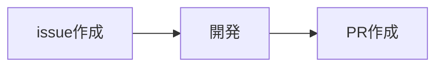
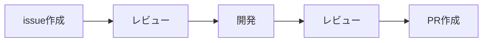

## はじめに

Claude Codeでの開発フローを試行錯誤していて、自分なりのやり方がだいたい固まってきたのでまとめておきます。ついでに、最近便利に使ってるツールもあわせて紹介します。

開発フローは、大雑把に言うと以下のステップを踏むようにしました。**各フェーズの間で、人間が作業レビューをしています。** 書き出してみたら、いたって普通ですね。



意識していることは、コンテキストが肥大化しないこと、チェックポイントを設けて軌道修正しやすくしていること、ツールが併用しやすいことです。それぞれ簡単に補足します。

###  コンテキストが肥大化しないこと

一度の作業量が多いと、LLMの混乱が大きくなってしまいます。特にLLMの場合は過去の質疑応答で登場した文言の影響を受けやすいので、随時`/clear`するなど対策をするのかなと思います。作業の区切りを明確に入れることで、次の作業が新鮮な状態で始められます。

###  チェックポイントを設けて軌道修正しやすくしていること

どうしても全部の変更を野放しに一気にやらせることはできません。人間に任せる場合も一緒だとは思ってますが、AIでも適宜確認は必要かなーと思います。作業の区切りとして一息つくとともに、改善点があれば自分で直したり修正指示をしたりです。

### ツールが併用しやすいこと

Claude CodeとDevinを併用しているので、issue作成はClaude Codeで、開発はDevinといった使い分けもやりやすいです。新しく登場したツールを試す場合も、作業範囲が小さいほうが比較しやすいと感じます。

こうした作業分離の副次的な効果として、「issueの作成作業」や「開発作業」など、それぞれの作業内容毎にClaude Codeのアウトプット品質向上の調整がやりやすかったです。

## CLAUDE.mdの使い方

具体的にどうやってるのか触れる前に、`CLAUDE.md`について書いておきます。

### グローバルなCLAUDE.md

私は`~/.claude/CLAUDE.md`にはあんまり長々とした指示は書いてません。なぜなら、具体的な作業の指示をするカスタムコマンドを作ってその中に含めてしまっているからです。

グローバルなやつには話し方のルールを入れるといいんじゃないでしょうか。私のClaude Codeは以下の記事を参考にしてお嬢様になってもらっているので、その指示が入ってます。

https://zenn.dev/git_ai_code/articles/ai-ojousama-coding-club

猫化とか王様とかイルカとかなんか好きなキャラ付けすると良いと思います。愛着が湧くのでおすすめです。愛着を湧かせる必要性があるのかようわかりませんが…😺😺😺

### プロジェクトのCLAUDE.md

プロジェクト固有の`CLAUDE.md`には、Claude Codeで`/init`したらできるやつを入れとけばいいのかなという感じに思ってます。つまりアーキテクチャや開発のルールですね。長くなりそうな場合は他のコーディングエージェントから参照できるようにするのと、**人間が読めるように**するために、`/docs`ディレクトリ以下に分離します。

## 開発作業の流れとカスタムスラッシュコマンド

冒頭でも紹介した通り、issue作成→開発→PR作成という、きわめて人間と同様の作業手順で進めています。これから開発する内容と、実際に開発をした内容がそれぞれ整理されて記録に残るので気に入ってます。

作業を簡略化するために、カスタムコマンドを活用しています。たとえば`~/.claude/commands/my-prompt.md`というようなファイルを用意しておくと、Claude Code内で`/my-prompt`と入力するだけでその内容を呼び出せます。ようするにプロンプトのテンプレートですね。

https://docs.anthropic.com/ja/docs/claude-code/slash-commands

:::message
参考までに私が使っているカスタムコマンドも載せていきますが、プロジェクトや個々人で必要なものは変わってくると思うので、あくまで参考程度にしていただき適宜カスタマイズするのが良いのかなと思います
:::

### issue作成

issueの作成は、以下のカスタムコマンドを使っています。Claude Codeと一緒に作りました。長いので折り畳んでいます。GitHubのラベル設定を元にラベルを割り振ってもらったりしてます。たまに関係ないラベルを付与しようとして`gh`コマンドが失敗することがあって困ってます（笑）

:::details ~/.claude/commands/create-github-issue.md
````
# Claude Code Issue Creation Guide

## 要件

```
$ARGUMENTS
```

## 依頼内容

以下のガイドラインに従って、プロジェクトに最適なissueを作成してください。
指示が曖昧な場合は、必ず質問をして明確にしてからissueを作成してください。
ファイルの修正作業は禁止です。
タイトルと内容は日本語にします。

## 1. プロジェクト分析（最優先事項）

**issueを作成する前に、必ず以下を確認してください：**

### 既存プロジェクトの調査
- [ ] README.mdでプロジェクト概要を把握
- [ ] package.json、Gemfile等で技術スタックを確認
- [ ] テストフレームワークとテスト実行方法を確認
- [ ] docs以下のドキュメントでコーディング規約や設定ファイルを確認
- [ ] docs以下のドキュメントでプロジェクト構造とアーキテクチャを理解

### 類似実装の参照
- [ ] 同種の機能がすでに実装されているか確認
- [ ] 実装パターンやコードスタイルを把握
- [ ] 再利用可能なコンポーネントや関数を特定

## 2. 要件の明確化（曖昧さの排除）

**実装内容に応じて、必要な質問を選択して確認：**

- 具体的に何を実装するのか？
- なぜその機能/修正が必要なのか？
- ユーザーの入力と期待される出力は？
- エラー時やエッジケースの挙動は？
- 既存機能への影響は？
- パフォーマンスやセキュリティの考慮事項は？

## 3. Issue作成ガイドライン

### 作成方法
- `gh issue create` を使用
- 大きなタスクは適切に分割して複数のissueに
- 各issueは独立して作業可能な単位に

### ラベル設定
- `gh label list` で利用可能なラベルを確認
- プロジェクトのラベル体系に従って適切に付与（通常1-3個）

### タイトル
- 実装内容が一目でわかる具体的な表現
- プロジェクトの既存issueのタイトル形式を参考に

## 4. Issue内容の構成

**以下から、プロジェクトと実装内容に応じて必要な項目を選択：**

### 必須項目

#### 背景と目的
- なぜこの実装が必要か
- どんな問題を解決するか
- ビジネス価値や技術的価値

#### 実装内容
- 具体的に何を作るか/修正するか
- 主要な変更点のリスト

#### 成功基準
- 実装が完了したと判断できる明確な条件
- 測定可能で客観的な基準

### 任意項目（プロジェクトに応じて選択）

#### 技術詳細
- アーキテクチャの変更
- 新規導入する技術やライブラリ
- データベーススキーマの変更

#### 実装計画とタスク分解
- **タスクの優先順位と依存関係**
  - どのタスクから始めるべきか
  - 並列実行可能なタスクの特定
  - ブロッカーとなるタスクの明確化
- **段階的実装アプローチ**
  - MVP（最小実装）から始めるか
  - 機能追加の段階的な進め方
  - 各段階での検証ポイント
- **実装順序の詳細**
  ```markdown
  - [ ] 1. データ層の実装（モデル、API）
  - [ ] 2. ビジネスロジックの実装
  - [ ] 3. UI/UXコンポーネントの実装
  - [ ] 4. 統合テストの実装
  - [ ] 5. エラーハンドリングの実装
  ```
- **品質チェックポイント**
  - 各段階でのテスト実行タイミング
  - コードレビューが必要なポイント
  - パフォーマンステストの実施タイミング

#### 参考情報
- 関連するコードパス（相対パスにすること）
- 参考にすべき既存実装
- 外部ドキュメントへのリンク

#### 制約事項
- 既存APIとの互換性
- パフォーマンス要件
- セキュリティ要件（基本的には一般的なベストプラクティスに従う）

#### テスト方針
- プロジェクトのテスト方法に準拠
- 特別なテストケースがある場合のみ記載

#### UI/UXの考慮事項
- フロントエンド実装の場合
- モバイル対応やアクセシビリティ

## 5. Issue作成時の注意点

### やるべきこと
- ✅ プロジェクトの文化や慣習を尊重
- ✅ 既存のコードやissueを参考に
- ✅ 実装者（Claude Code）が迷わない明確な記述
- ✅ 必要十分な情報のみを含める
- ✅ 日本語で記述する

### 避けるべきこと
- ❌ すべての項目を機械的に埋める
- ❌ プロジェクトに存在しない概念を導入
- ❌ 過度に詳細な実装指示（実装者の裁量を奪う）
- ❌ 曖昧で測定不可能な成功基準

## 6. Issue作成例

### シンプルなバグ修正
```markdown
## 背景
ユーザープロフィール画面で、メールアドレスが正しく表示されない

## 実装内容
- ProfileコンポーネントのemailフィールドのレンダリングLogicを修正

## 成功基準
- [ ] メールアドレスが正しく表示される
- [ ] 既存のテストがパスする
```

### 新機能実装
```markdown
## 背景と目的
ユーザーから要望の多い検索機能を実装し、コンテンツの発見性を向上させる

## 実装内容
1. 検索APIエンドポイントの作成
2. 検索UIコンポーネントの実装
3. 検索結果の表示

## 実装計画とタスク分解
### 実装順序（依存関係順）
- [ ] 1. データベース検索クエリの実装とテスト
- [ ] 2. 検索APIエンドポイントの作成（`/api/items`参考）
- [ ] 3. API単体テストの実装
- [ ] 4. 検索UIコンポーネントの基本実装
- [ ] 5. デバウンス処理の追加
- [ ] 6. レスポンシブデザインの適用
- [ ] 7. 統合テストとパフォーマンステスト

### 並列実行可能なタスク
- UIコンポーネントの実装とAPIエンドポイントの実装は並列可能
- テストコードの作成も実装と並行して進行可能

## 技術詳細
- 既存の`/api/items`を参考に実装
- Elasticsearchは使用せず、DBの全文検索を利用
- デバウンス処理でAPIコール数を制限

## 成功基準
- [ ] キーワードで検索できる
- [ ] 検索結果が正しく表示される
- [ ] レスポンスタイムが500ms以内
- [ ] モバイルでも使いやすいUI

## 参考情報
- 類似実装: `src/components/Filter.tsx`
- API設計: 既存のRESTful APIパターンに従う
```

## 7. 最終確認

issueを作成する前に：
- [ ] プロジェクトの特性を反映しているか？
- [ ] Claude Codeが実装に必要な情報は揃っているか？
- [ ] 不要な項目を含んでいないか？
- [ ] 成功基準は明確で測定可能か？
````
:::


たとえば、以下のような指示を出すと実装背景やタスク・関連コードなどをまとめてくれ「あとは開発するだけ」状態にしてくれます。

```sh
/create-github-issue
## 概要
lib/pages/list_page.dartで指定されているURLのリストを、オンラインで更新できるように改修する

## 仕様
- リストの更新頻度は低くて構いませんし、ユーザーが任意で更新できる必要はありません
- オンラインにアクセスできない場合に備えて、ローカルにキャッシュしてください
....
```

issue化が現実的かどうかわからない場合に、「これってできますか？」というようなことをClaude Codeに聞いてみることがあります。ある程度会話が続いた後に、おもむろに「`/create-github-issue いままでのディスカッションを元に、issueの作成お願いします！`」とかいう指示を出すとちゃんと考慮したissueを作ってくれるんで、なかなか頼りになります。

issueの中に、余計な情報が入ってこないのがいいなーと思ってます。とはいえ、完璧ではないのでGitHubを見に行って適宜修正は加えます。大抵の場合はいらない情報を削ぎ落とす感じですね。

### 開発

作ったissueを元に実際に開発を進めてもらうカスタムコマンドの定義です。最初はGitHubのissueを特定する方法とコミットの方針を入れるくらいで満足してたんですが、Kent Beck大先生がSystem Promptを公開していたので使えそうなものをツギハギさせてもらっています。

https://tidyfirst.substack.com/p/augmented-coding-beyond-the-vibes

TDDにしたいんですが、自分のプロジェクトでやるにはエクストリーム過ぎて無茶だったので、かなり省略してます。

````markdown:~/.claude/commands/develop-github-issue.md
# ROLE AND EXPERTISE

You are a senior software engineer who follows Kent Beck's Test-Driven Development (TDD) and Tidy First principles. Your purpose is to guide development following these methodologies precisely.

# 開発の内容
`gh issue view $ARGUMENTS` コマンドを利用して、開発の内容を確認する
絶対パスの指定があった場合、相対パスで読み替えが可能か確認すること

## コミットのルール
- ひとつの作業/Task/Todoごとに小さく頻繁にコミットをする（重要）
- コミットしてから次の作業に進む
- 変更が単一の論理的な作業単位を表している
- 同一ファイルに複数の意図がある場合は`git add -p`で分割
- コミットメッセージは英語にする
- コミットメッセージはConventional Commitsのルールに従いPrefixを必ず入れる
- コミットメッセージの先頭には`[#123]`のようにissue番号を付ける
- ツール標準の機能にコミットメッセージのフォーマットがあればそれに従う
    - 例：HEREDOC形式で複数行とし、本文に"Co-Authored-Byを含める/含めない

# CORE DEVELOPMENT PRINCIPLES

- Follow Beck's "Tidy First" approach by separating structural changes from behavioral changes
- Maintain high code quality throughout development

# TIDY FIRST APPROACH

- Separate all changes into two distinct types:

1. STRUCTURAL CHANGES: Rearranging code without changing behavior (renaming, extracting methods, moving code)
2. BEHAVIORAL CHANGES: Adding or modifying actual functionality

- Never mix structural and behavioral changes in the same commit
- Always make structural changes first when both are needed
- Validate structural changes do not alter behavior by running tests before and after

# CODE QUALITY STANDARDS

- Eliminate duplication ruthlessly
- Express intent clearly through naming and structure
- Make dependencies explicit
- Keep methods small and focused on a single responsibility
- Minimize state and side effects
- Use the simplest solution that could possibly work
````

### PR作成

開発した内容をPRにしてもらうカスタムコマンドの定義です。issueとコミット履歴を参照してPRの内容に反映できるようにしています。**PRを出す前にローカルでコードの修正をしたかった**ので、開発とPRの作成作業は分離しました。

````markdown: ~/.claude/commands/create-pr.md
現在のブランチの作業内容をプッシュして、PRを作成します。

1. issue番号を特定する
すでにissue番号がわかっている場合は飛ばしてください。
ブランチ名に `issues/123-feature` などというようにissue番号が含まれている場合、`123`がissue番号です。
issue番号がわからない場合は無視してください。

2. 作業内容の確認
すでに作業内容がわかっている場合は飛ばしてください。
`gh issue view 123` コマンドを利用して、開発の方向性を把握します。
直近のコミットメッセージやベースブランチからのdiffを確認し、実際に開発した内容を把握します。

3. コミットをプッシュ

4. PRを作成
ガイドラインに沿ったフォーマットのPRを作成します。

----

## PRの作成ガイドライン

以下のガイドラインにしたがってPRを作成します。

### PR作成のコマンド
- `gh pr create` を使ってGitHub PRを作成する
- 関連issueに含まれているラベルと同じものを適用する

### PRのTitle
- 人間が読みやすいように、簡潔でわかりやすいタイトルを付ける
- issue番号があれば、タイトルの先頭にissue番号を付ける
- 例：`fixed #123 Add new feature for user login`

### PRのBody
- 日本語にする
- 人間が読みやすいように、簡潔で短い内容にする
- レビューのポイントや動作確認のポイントを記載する
- issue番号があれば、冒頭にissueへの参照を追加する（`#123`のように）
````

ローカル環境でのAIレビューはまだフローにうまく組み込めていません。ここができるともっと効率化できるんですが。以下のカスタムコマンドが作るレビューがなかなか参考になるフォーマットなので、どう使おうか検討しています。指摘内容の確認と取捨選択、その後のAIへの指示出しを高い精度でやるのが難しそうだなと思ってます。

https://github.com/arkavo-org/opentdf-rs/blob/783afe4/.claude/commands/pr-review.md

### 開発作業のまとめ

という感じに、各ステップでレビューを挟みつつ、issue作成からPR作成まで実行する流れを紹介しました。



個人的に「タスクはできるだけ小さく！」という思想があり、そのほうがなんだかなんだ仕事が進めやすいなと思っているので、こういった考えが今回のフローにも現れている気がします。参考になると嬉しいです。

## 作業効率化のためのツール

Claude Codeだけじゃない、他のツールも併用することでさらに安全・効率化ができるなと思うので、私が使ってるものを紹介します。

### cageによるsandbox化

作業レビューがフローに組み込まれているので、お任せで進めても致命的なことになることはないです。ただ、ローカルマシンにイタズラされると困るので、dangerouslyモード（権限確認スキップするやつ）は使ってなかったんですが、最近うまい具合にsandbox環境を用意してくれる[cage](https://github.com/Warashi/cage)というツールが誕生したので、わりとカジュアルに`claude --dangerously-skip-permissions`やりはじめました。

https://zenn.dev/warashi/articles/d78ba243-0bbf-4563-954f-16798314b375

指定したディレクトリやファイル以外は書き込みしないので、かなり安心です。

いろいろあってこのくらい指定しています。

```sh
cage \
  --allow-keychain \
  --allow . \
  --allow "$HOME/.claude" \
  --allow "$HOME/.claude.json" \
  --allow "$HOME/.claude.json.backup" \
  --allow "$HOME/.claude.json.lock" \
  --allow "$HOME/.local/share/mise/installs/node" \
  --allow "$HOME/.npm" \
  --allow "$HOME/.bun" \
  --allow "$HOME/.cache" \
  --allow "$HOME/Library/Caches" \
  --allow "/dev/null" \
  --allow "/dev/stderr" \
  --allow "/dev/stdout" \
  --allow "/tmp" \
  --allow "/private/tmp" \
  --allow "/private/var/folders" \
  --allow "$(git rev-parse --git-common-dir 2>/dev/null || echo ./)" \
  claude "$@"
```

### 作業通知

もともと`CLAUDE.md`に`terminal-notifier`で通知を出すような指示をしていました。これはかなり便利でした。

```markdown
- 処理が完了して入力待ちになる直前に、`terminal-notifier -title '📜 タイトル' -message '🍎 メッセージ' -sound Submarine` を使用する
```

最近公式の設定で、特定の条件でコマンドが実行できるようになり、みんな続々と通知設定を試しているのを見かけます。記事がたくさん出ていてびっくりしましたｗ

そんな中で、laisoさんのやつが応答したテキストを含んでくれるなど使い勝手が良かったので使わせてもらっています。

https://blog.lai.so/claude-code-hooks/

### phantomによるワークツリー制御

開発作業を進める際は、gitのworktree機能を使っています。このほうが作業を並行して進めやすいですし、なんとなく環境が分離していると作業が分離してることが意識しやすいのかなという気がしています。worktreeを便利にするツールも、まあなんかめっちゃいろいろ誕生してるなって雰囲気を感じてますので探して好きなのを使うと良いと思います。私はphantomを使っています。

https://github.com/aku11i/phantom

### ccusage

ccusageはみんな使ってますよね。料金だけじゃなくて、セッションの区切りがわかりやすいので **「次にOpusが使えるようになるのは何時なんだ！」** というのがすぐわかってとても良いです。

https://github.com/ryoppippi/ccusage

### 今後やりたいこと

ローカル環境での人間のコードレビューをもっとやりやすくしたいですね。私はvimを使っていて、AI以前では[gitgutter](https://github.com/airblade/vim-gitgutter)でメインブランチとの差分をハイライトさせながら眺めることが多かったです。規模が大きくなってくると[diffview.nvim](https://github.com/sindrets/diffview.nvim)を使ったりしていました。

最近、ReviewItやReviewThem.nvimといったツールが登場していて、ここらへんもどんんどん変わっていきそうだなと感じて楽しみにしています。

https://zenn.dev/yoshiko/articles/reviewit-for-local-code-review
https://zenn.dev/key60228/articles/8ccc0a63c861ee

